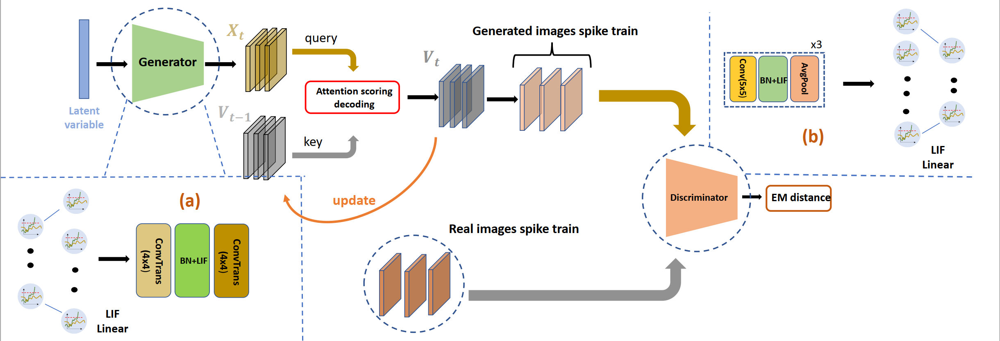
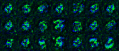
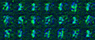

# Spiking Generative Adversarial Network with Attention Scoring Decoding (SGAD)

This is the code implementation for the paper "Spiking Generative Adversarial Network with Attention Scoring Decoding (SGAD)".

This project includes implementations of three models (SGAN, SWGAN and SGAD) on two datasets (MNIST and CelebA).

[](https://opensource.org/licenses/Apache-2.0)

## Table of Contents

- [Abstarct](#abstract)
- [Installation](#installation)
- [Usage](#usage)

## Abstract

Generative models based on neural networks present a substantial challenge within deep learning. As it stands, such models are primarily limited to the domain of artificial neural networks. Spiking neural networks, as the third generation of neural networks, offer a closer approximation to brain-like processing due to their rich spatiotemporal dynamics. However, generative models based on spiking neural networks are not well studied. Particularly, previous works on generative adversarial networks based on spiking neural networks are conducted on simple datasets and do not perform well. In this work, we pioneer constructing a spiking generative adversarial network capable of handling complex images and having higher performance. Our first task was to identify the problems of out-of-domain inconsistency and temporal inconsistency inherent in spiking generative adversarial networks. We addressed these issues by incorporating the Earth-Mover distance and an attention-based weighted decoding method, significantly enhancing the performance of our algorithm across several datasets. Experimental results reveal that our approach outperforms existing methods on the MNIST, FashionMNIST, CIFAR10, and CelebA datasets.Besides these static datasets, we also firstly attempt at generating event-based data on NMNIST dataset. Moreover, compared with hybrid spiking generative adversarial networks, where the discriminator is an artificial analog neural network, our methodology demonstrates closer alignment with the information processing patterns observed in the mouse. Our code could be found at https://github.com/Caelum2000/sgad




## Installation

```bash
# Clone the repository
git clone https://github.com/Caelum2000/sgad.git

# Navigate to the directory
cd sgad

# Install dependencies
pip install -r requirements.txt

```

## Usage

### Quick Start
```bash
# Run SGAD on MNIST
python train/train_sgad_mnist.py --config train/sgad_mnist.yaml

# Run SGAD on CelebA
python train/train_sgad_celeba.py --config train/sgad_celeba.yaml

# Run SGAN on MNIST
python train/train_sgan_mnist.py --config train/sgan_mnist.yaml

# Run SWGAN on MNIST
python train/train_swgan_mnist.py --config train/swgan_mnist.yaml

# Run SWGAN on CelebA
python train/train_swgan_celeba.py --config train/swgan_celeba.yaml

# Run on NMNIST
python train/train_nmnist.py --config train/nmnist_28.yaml
```

### Custom Run
You could change .yaml file to custom running, including data path, learning rate etc.

```bash
Network:
  save_every: 5  # save checkpoint period
  name: "swgan_celeba"  # name of training
  data_path: "../data" # where store data
  epochs: 100  # epoch to train
  batch_size: 64  # batch size
  lr_D: 0.0002  # learning rate of Discriminator
  lr_G: 0.0002  # learning rate of Generator
  is_scheduler: False  # whether to use CosineAnnealing scheduler
  n_steps: 16  # time steps for spiking neural network
  encode_type: "direct"  # encoding type 
  device: "cuda:0"  # device to use
  net_D_direct_input: True # This determines net_D input shape, (...,784) or (...,28,28)
  dataset: "CelebA"  # which dataset
  is_data_normlized: False  # whether to normalize data
  latent_dim: 20  # latent dim for Generator
  is_mem: True  # whether to use membrane potential for outputs
  from_checkpoint: False  # whether to load checkpoint
  checkpoint_path: ""  # checkpoint path
  scoring_mode: "AttentionScoring_RGB"  # attention scoring mode
```


## Dynamic Visualization on NMNIST

### Sample from SGAD


### Sample from SWGAN

